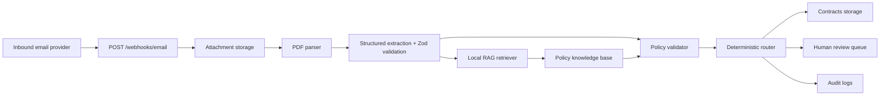
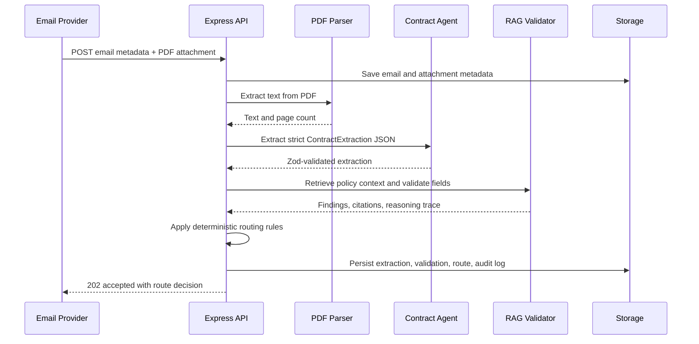
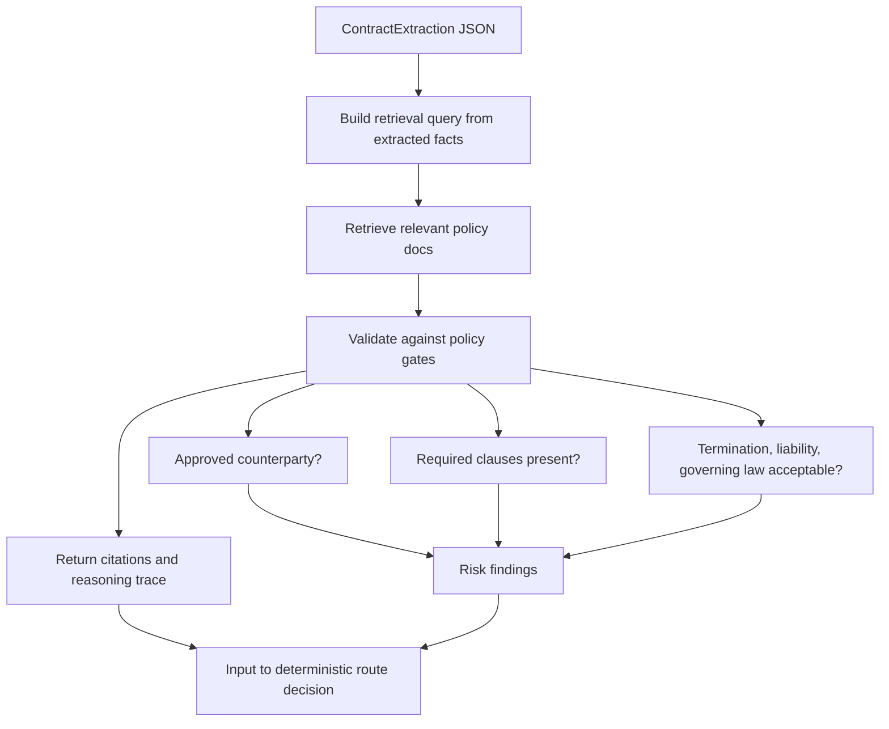
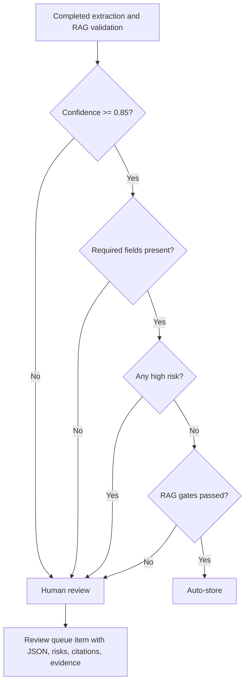
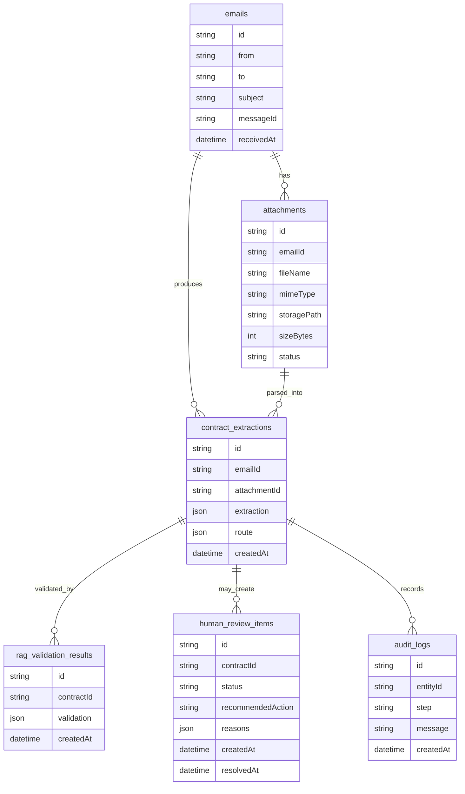

# Architecture

## System Architecture

```mermaid
flowchart LR
  Email["Inbound email provider"] --> Webhook["POST /webhooks/email"]
  Webhook --> Attachment["Attachment storage"]
  Attachment --> Parser["PDF parser"]
  Parser --> Extractor["Structured extraction + Zod validation"]
  Extractor --> Retriever["Local RAG retriever"]
  Retriever --> Policies["Policy knowledge base"]
  Extractor --> Validator["Policy validator"]
  Policies --> Validator
  Validator --> Router["Deterministic router"]
  Router --> Store["Contracts storage"]
  Router --> Review["Human review queue"]
  Router --> Audit["Audit logs"]
```

## Email-To-Agent Sequence

```mermaid
sequenceDiagram
  participant Provider as Email Provider
  participant API as Express API
  participant PDF as PDF Parser
  participant Agent as Contract Agent
  participant RAG as RAG Validator
  participant DB as Storage
  Provider->>API: POST email metadata + PDF attachment
  API->>DB: Save email and attachment metadata
  API->>PDF: Extract text from PDF
  PDF-->>API: Text and page count
  API->>Agent: Extract strict ContractExtraction JSON
  Agent-->>API: Zod-validated extraction
  API->>RAG: Retrieve policy context and validate fields
  RAG-->>API: Findings, citations, reasoning trace
  API->>API: Apply deterministic routing rules
  API->>DB: Persist extraction, validation, route, audit log
  API-->>Provider: 202 accepted with route decision
```

## RAG Validation Flow

```mermaid
flowchart TD
  Extraction["ContractExtraction JSON"] --> Query["Build retrieval query from extracted facts"]
  Query --> Retrieve["Retrieve relevant policy docs"]
  Retrieve --> Validate["Validate against policy gates"]
  Validate --> Counterparty["Approved counterparty?"]
  Validate --> Clauses["Required clauses present?"]
  Validate --> Terms["Termination, liability, governing law acceptable?"]
  Validate --> Citations["Return citations and reasoning trace"]
  Counterparty --> Findings["Risk findings"]
  Clauses --> Findings
  Terms --> Findings
  Citations --> Route["Input to deterministic route decision"]
  Findings --> Route
```

## Human Review Routing

```mermaid
flowchart TD
  Start["Completed extraction and RAG validation"] --> Confidence{"Confidence >= 0.85?"}
  Confidence -- No --> Review["Human review"]
  Confidence -- Yes --> Missing{"Required fields present?"}
  Missing -- No --> Review
  Missing -- Yes --> Risks{"Any high risk?"}
  Risks -- Yes --> Review
  Risks -- No --> Rag{"RAG gates passed?"}
  Rag -- No --> Review
  Rag -- Yes --> Store["Auto-store"]
  Review --> Queue["Review queue item with JSON, risks, citations, evidence"]
```

## Database / Entity Relationship

```mermaid
erDiagram
  emails ||--o{ attachments : has
  emails ||--o{ contract_extractions : produces
  attachments ||--o{ contract_extractions : parsed_into
  contract_extractions ||--o{ rag_validation_results : validated_by
  contract_extractions ||--o{ human_review_items : may_create
  contract_extractions ||--o{ audit_logs : records

  emails {
    string id
    string from
    string to
    string subject
    string messageId
    datetime receivedAt
  }
  attachments {
    string id
    string emailId
    string fileName
    string mimeType
    string storagePath
    int sizeBytes
    string status
  }
  contract_extractions {
    string id
    string emailId
    string attachmentId
    json extraction
    json route
    datetime createdAt
  }
  rag_validation_results {
    string id
    string contractId
    json validation
    datetime createdAt
  }
  human_review_items {
    string id
    string contractId
    string status
    string recommendedAction
    json reasons
    datetime createdAt
    datetime resolvedAt
  }
  audit_logs {
    string id
    string entityId
    string step
    string message
    datetime createdAt
  }
```
